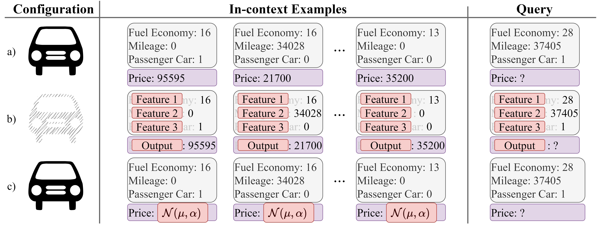

# Learning vs Retrieval: The Role of In-Context Examples in Regression with LLMs (NAACL 2025)

## Project Overview

This project explores the in-context learning (ICL) capabilities of Large Language Models (LLMs) in regression tasks. It aims to evaluate the extent to which LLMs retrieve internal knowledge versus learn from in-context examples. The research proposes a framework for evaluating in-context learning mechanisms, focusing on regression tasks using real-world datasets.

Key aspects of the project include:

1. Demonstrating LLMs' ability to perform regression on realistic datasets.
2. Measuring the balance between internal knowledge retrieval and learning from in-context examples.
3. Analyzing factors that influence these mechanisms, such as prior knowledge about tasks and the information provided by in-context examples.
4. Providing insights for prompt engineering to leverage meta-learning and foster knowledge retrieval.

## Prompt Configurations:


*Figure 1: Overview of the main prompt configurations used in our experiments.*

1. Named Features (Configuration a): Reveals actual names of features and target variable
2. Anonymized Features (Configuration b): Uses generic names like "Feature #" and "Output"
3. Randomized Ground Truth (Configuration c): Maintains named features but replaces ground truth with random numbers
4. Direct Question Answering (Direct QA): Asks LLM to estimate target variable without in-context examples

## Datasets

The project uses the following datasets:

1. `Insurance_Cost`[^1]
2. `Admission_Chance`[^2]
3. `Used_Car_Prices`[^3]

[^1]: [Medical Cost Personal Datasets](https://www.kaggle.com/datasets/mirichoi0218/insurance)
[^2]: [Graduate Admissions](https://www.kaggle.com/datasets/mohansacharya/graduate-admissions)
[^3]: [US Used Cars Dataset](https://www.kaggle.com/datasets/ananaymital/us-used-cars-dataset)

## Files

- `main_openai.py`: Script for running experiments with OpenAI models
- `main_llama.py`: Script for running experiments with Meta's LLaMA model
- `test.py`: Script for evaluating model performance
- `utils.py`: Utility functions for file naming, example creation, and response processing
- `reader.py`: Functions for reading and preprocessing datasets

## Usage

### OpenAI Models

To run experiments with OpenAI models:

```
python main_openai.py --api-key-token YOUR_API_KEY [other arguments]
```

### LLaMA Model

To run experiments with Meta's LLaMA model:

```
python main_llama.py --api-key-token YOUR_API_KEY [other arguments]
```

### Evaluating Results

To evaluate the performance of the models:

```
python test.py [arguments]
```

### Arguments Overview

All scripts use a variety of shared arguments. Below is a summary of them:

- `--datasets`: List of datasets to evaluate (default: `["Insurance_Cost", "Admission_Chance", "Used_Car_Prices"]`)
- `--models`: List of models to use (varies by script)
- `--in-context-numbers`: List of in-context example numbers (default: `[0, 10, 30, 100]`)
- `--feature-nums`: List of feature numbers to use (default range: `[1, 2, 3, 4]`)
- `--configs`: List of prompt configurations
- `--api-key-token`: **Required** API key for the respective service
- `--test-sample-num`: Number of test samples to evaluate (default: `300`)
- `--max-retries`: Number of retries before skipping an instance (default: `10`)
- `--output-folder`: Folder to save output results (default: `LLM_Results`)
- `--testing-sampling`: Sampling number for outputs (default: `0`)
- `--seed`: Random seed for reproducibility (OpenAI script only, default: `100`)
- `--input-folder`: Folder to read LLM results from (test script only, default: `LLM_Results`)

## Example Commands

### LLaMA Models

```bash
python main_llama.py --api-key-token YOUR_API_KEY --datasets Insurance_Cost --models meta/meta-llama-3-70b-instruct --in-context-numbers 10 30 --feature-nums 1 2 --configs Named_Features --test-sample-num 200 --output-folder output_llama
```

### OpenAI Models

```bash
python main_openai.py --api-key-token YOUR_API_KEY --datasets Admission_Chance --models gpt-4-0125-preview --in-context-numbers 10 --feature-nums 1 3 --configs Anonymized_Features --seed 42 --output-folder output_openai
```

### Evaluation

```bash
python test.py --datasets Used_Car_Prices --models gpt-3.5-turbo-0125 --in-context-numbers 0 --feature-nums 1 4 --configs Reasoning --input-folder LLM_Results --output-folder Evaluation_Results
```

## Data Preprocessing and Traditional ML Model Training

For instructions on data preprocessing and training traditional machine learning models, please refer to the `readme.md` file in the Datasets folder.

## Requirements

- pandas
- numpy
- scikit-learn
- openai
- replicate
